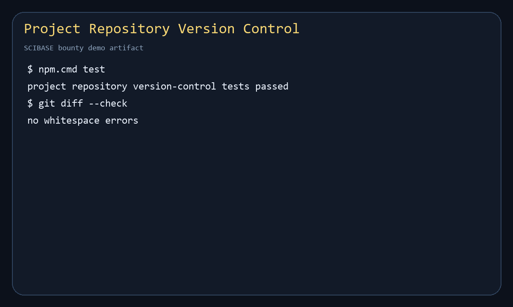

# Project Repository and Version Control

This module implements an MVP reference design for SCIBASE scientific project repositories, matching issue #10. It is dependency-free and can be run with Node.js.

## What This Provides

- Scientific repository structure for manuscripts, data, code, notebooks, results, protocols, and metadata.
- Commit history, branch heads, semantic tags, rollback, and content hashes.
- Fork metadata, merge requests, review state, and contributor provenance.
- Editor and diff capability metadata for Markdown, LaTeX, CSV, JSON, notebooks, and code files.
- Reproducibility checks for pipelines, container/environment files, raw data, code, and outputs.
- DOI-aware citation helpers and export manifests.
- REST and CLI contract definitions for future platform integration.

## Layout

```text
project-repository-version-control/
  demo/demo.js
  schema/project-repository.schema.json
  src/repositoryVersionControl.js
  test/repositoryVersionControl.test.js
  requirements-map.md
```

## Run

```bash
npm test
npm run demo
```

No external services or packages are required.

## Demo



## Example

```js
const {
  createRepository,
  createCommit,
  tagVersion,
  checkReproducibility,
} = require("./src/repositoryVersionControl")

const repo = createRepository({
  id: "alzheimers-biomarker-study",
  title: "Alzheimer's Biomarker Study",
  authors: [{ name: "A. Researcher", orcid: "0000-0001-2345-6789" }],
  affiliations: ["SCIBASE Lab"],
  funding: ["Grant-123"],
  tags: ["biomarkers", "reproducibility"],
})

const commit = createCommit(repo, {
  author: "A. Researcher",
  message: "Add raw data, analysis notebook, and first result figure",
  changes: [
    { path: "data/cohort.csv", content: "participant,marker\np1,0.42" },
    { path: "notebooks/run_analysis.ipynb", content: "{}" },
    { path: "results/figure-1.png", content: "binary-placeholder" },
  ],
})

tagVersion(repo, {
  name: "preprint-v1.0",
  commitId: commit.id,
  doi: "10.5555/scibase.alzheimers-biomarker-study.v1",
})

console.log(checkReproducibility(repo))
```

## Design Notes

This implementation keeps all state in a plain JavaScript object so the domain model can be reviewed quickly. A production backend can persist the same schema in Postgres, object storage, and a Git-compatible service.

Large files should be stored by content address or Git LFS in production. This MVP records content hashes and paths to preserve reproducibility semantics without committing large binary data.
