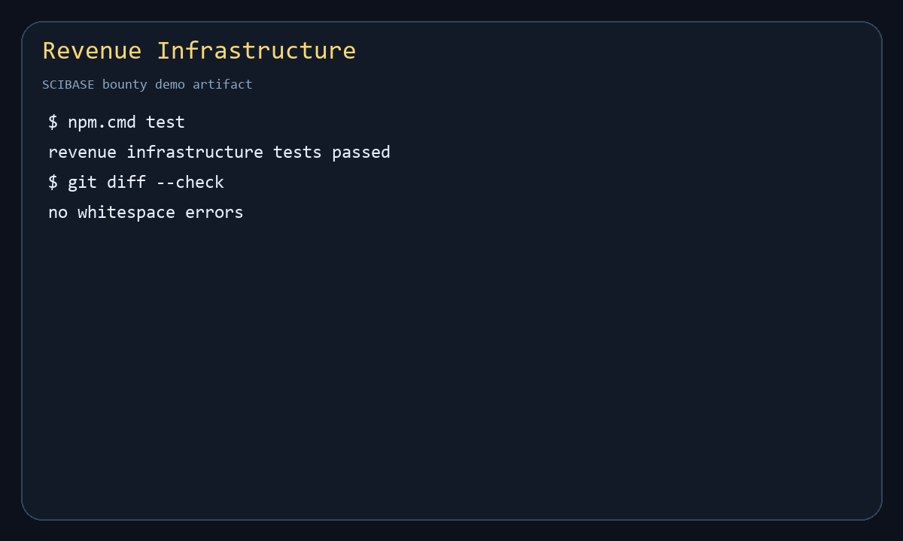

# Revenue Infrastructure

This module implements an MVP reference design for SCIBASE revenue infrastructure, matching issue #20. It is dependency-free and can be run with Node.js.

## What This Provides

- Tiered subscription plans for individuals, labs, and institutions.
- Monthly and annual billing cycles.
- Volume discounts, consortium coupons, and free trials.
- Payment method records for cards, PayPal, and institutional invoicing.
- Institutional invoice generation with purchase-order tracking.
- Usage-based compute products for inference, training, reproducibility checks, deployment, and quantum runs.
- Transparent usage meters with included quotas, top-ups, and remaining credits.
- Data licensing products for anonymized research analytics, dashboards, APIs, and white-label access.
- Account-level billing summaries with events for auditing and support.

## Layout

```text
revenue-infrastructure/
  demo/demo.js
  schema/revenue-infrastructure.schema.json
  src/revenueInfrastructure.js
  test/revenueInfrastructure.test.js
  requirements-map.md
```

## Run

```bash
npm test
npm run demo
```

No external services or packages are required.

## Demo



## Example

```js
const {
  BILLING_CYCLES,
  CUSTOMER_TYPES,
  createCustomer,
  createPlan,
  createRevenueState,
  createSubscription,
} = require("./src/revenueInfrastructure")

const state = createRevenueState()

createPlan(state, {
  id: "individual-pro",
  name: "Individual Pro",
  customerType: CUSTOMER_TYPES.individual,
  monthlyPriceCents: 1900,
  annualPriceCents: 19000,
  includedComputeCredits: 500,
})

createCustomer(state, {
  id: "researcher-1",
  type: CUSTOMER_TYPES.individual,
  name: "Dr. Ada Researcher",
  billingEmail: "ada@example.edu",
})

createSubscription(state, {
  customerId: "researcher-1",
  planId: "individual-pro",
  billingCycle: BILLING_CYCLES.monthly,
  startsAt: "2026-05-13T00:00:00.000Z",
})
```

## Design Notes

This implementation stores state in plain JavaScript objects so the billing, metering, and licensing rules can be reviewed quickly. A production backend can persist the same entities in a database, connect payment rails to PCI-compliant providers, and route institutional invoices through finance workflows without changing the core domain model.
