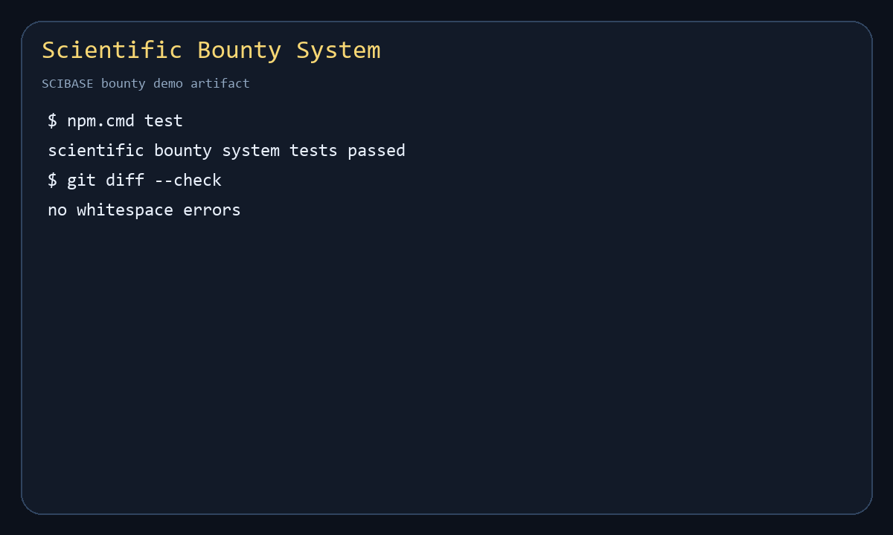

# Scientific Bounty System

This module implements an MVP reference design for SCIBASE scientific bounties: challenge posting, submission workspaces, evaluation, arbitration, and reward distribution. It is dependency-free and can be run with Node.js.

## What This Provides

- Sponsor records with escrow funding accounts.
- Challenge posting with problem description, scientific context, deliverables, rubric, deadlines, prize amount, and payout schedule.
- Public/private challenge visibility, pre-qualification, NDA flags, and vertical templates.
- Secure submission workspaces with code, data, documents, notebooks, execution tools, versioned artifacts, and audit logs.
- Named or anonymous participation modes.
- Automated submission manifests with content hashes and deliverable completeness checks.
- Multi-phase challenge milestones.
- Weighted evaluation dashboards for sponsors and reviewers.
- Arbitration decisions before payout release.
- Escrowed milestone payouts, partial rewards, and team payout routing.
- IP status handling for solver-retains-until-paid, sponsored transfer, and open-source policies.

## Layout

```text
scientific-bounty-system/
  demo/demo.js
  schema/scientific-bounty-system.schema.json
  src/scientificBountySystem.js
  test/scientificBountySystem.test.js
  requirements-map.md
```

## Run

```bash
npm test
npm run demo
```

No external services or packages are required.

## Demo



## Example

```js
const {
  CHALLENGE_VISIBILITY,
  IP_POLICIES,
  createBountyState,
  createChallenge,
  createSponsor,
} = require("./src/scientificBountySystem")

const state = createBountyState()
const sponsor = createSponsor(state, {
  id: "sponsor-1",
  name: "Climate Futures Foundation",
  organizationType: "nonprofit",
  payoutAccount: "escrow:climate-futures",
})

createChallenge(state, {
  id: "challenge-1",
  sponsorId: sponsor.id,
  title: "Regional Flood Forecasting Model",
  vertical: "climate",
  visibility: CHALLENGE_VISIBILITY.public,
  problemDescription: "Build a reproducible regional flood forecasting model.",
  scientificContext: "Use rainfall, river gauge, and land-use data.",
  deliverables: ["working model", "dataset", "whitepaper"],
  evaluationCriteria: [
    { name: "accuracy", weight: 0.45 },
    { name: "reproducibility", weight: 0.35 },
    { name: "clarity", weight: 0.2 },
  ],
  prizeAmountCents: 100000,
  payoutSchedule: [
    { phase: "proposal", percent: 20 },
    { phase: "prototype", percent: 30 },
    { phase: "final", percent: 50 },
  ],
  ipPolicy: IP_POLICIES.solverRetainsUntilPaid,
})
```

## Design Notes

This implementation keeps state in plain JavaScript objects so challenge economics and arbitration flow are easy to review. A production backend can persist the same event model, add identity/KYC checks, integrate escrow providers, and attach signed legal terms without changing the core challenge lifecycle.
