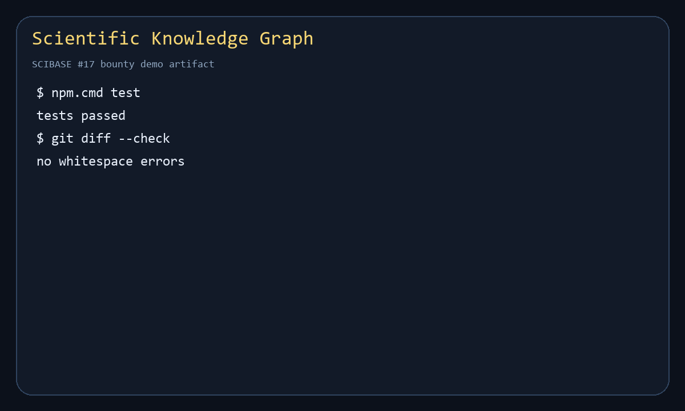

# Scientific Knowledge Graph

This module implements a dependency-free MVP for SCIBASE scientific knowledge graph integration. It turns uploaded research objects into typed graph nodes, evidence-backed relationships, entity pages, schema.org JSON-LD, graph navigation payloads, and recommendation digests.

## What This Provides

- Research object ingestion for papers, datasets, notebooks, and protocols.
- Deterministic entity extraction for concepts, gene-like symbols, tools, datasets, protocols, references, and DOIs.
- Author and affiliation graph construction.
- Evidence-backed relationships for authored, cites, mentions, uses, reuses, affiliated-with, and co-occurs-with.
- Entity pages with citations, usage contexts, related nodes, and JSON-LD.
- Graph search and navigation filters by domain, node type, relationship type, evidence count, and text.
- Influence-path traversal between graph entities.
- Recommendation payloads for workspace sidebars or weekly digest emails.
- Schema.org-compatible export for downstream linked data consumers.

## Layout

```text
scientific-knowledge-graph/
  demo/demo.js
  docs/demo.gif
  schema/scientific-knowledge-graph.schema.json
  src/scientificKnowledgeGraph.js
  test/scientificKnowledgeGraph.test.js
  requirements-map.md
```

## Run

```bash
npm test
npm run demo
```

No external services or packages are required.

## Demo



## Example

```js
const {
  RESEARCH_OBJECT_TYPES,
  createKnowledgeGraphState,
  ingestResearchObject,
  registerProject,
} = require("./src/scientificKnowledgeGraph")

const state = createKnowledgeGraphState()

registerProject(state, {
  id: "project-neuro-crispr",
  title: "Neurogenomics CRISPR Atlas",
  domain: "neuroscience",
  ownerId: "user-42",
  interests: ["CRISPR", "single-cell RNA sequencing"],
})

ingestResearchObject(state, {
  id: "paper-neuro-1",
  type: RESEARCH_OBJECT_TYPES.paper,
  title: "CRISPR perturbation maps neural disease pathways",
  domain: "neuroscience",
  projectId: "project-neuro-crispr",
  content: "CRISPR and single-cell RNA sequencing identify TP53-linked circuits.",
  authors: [{ name: "Mina Chen", affiliation: "Atlas Institute" }],
})
```

## Design Notes

The module keeps state in plain JavaScript objects so reviewers can inspect the graph model without provisioning a database, embedding service, or external NLP model. A production rollout can replace deterministic extraction with domain-tuned NLP, persist nodes and edges, and add permission checks without changing the public graph payload shapes.
